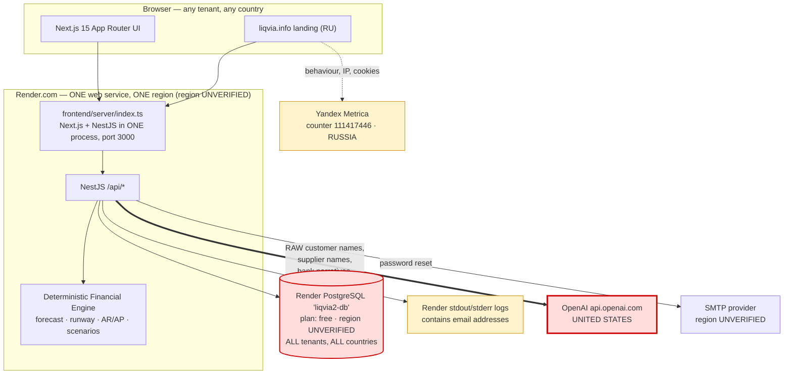
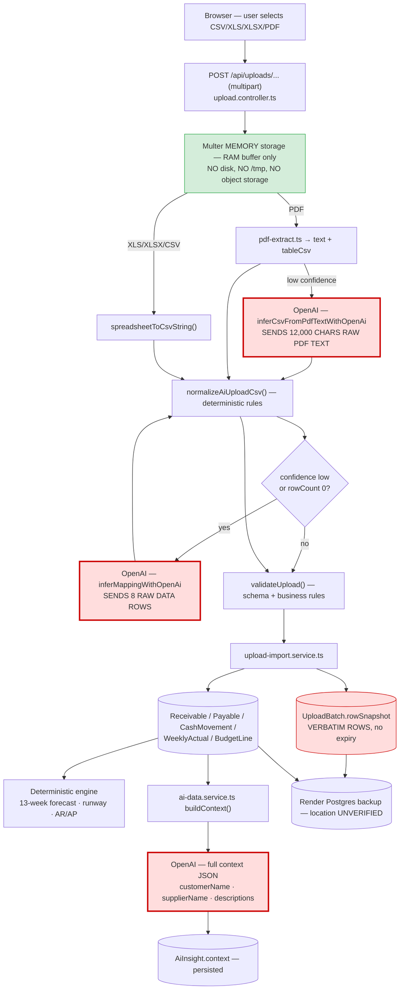
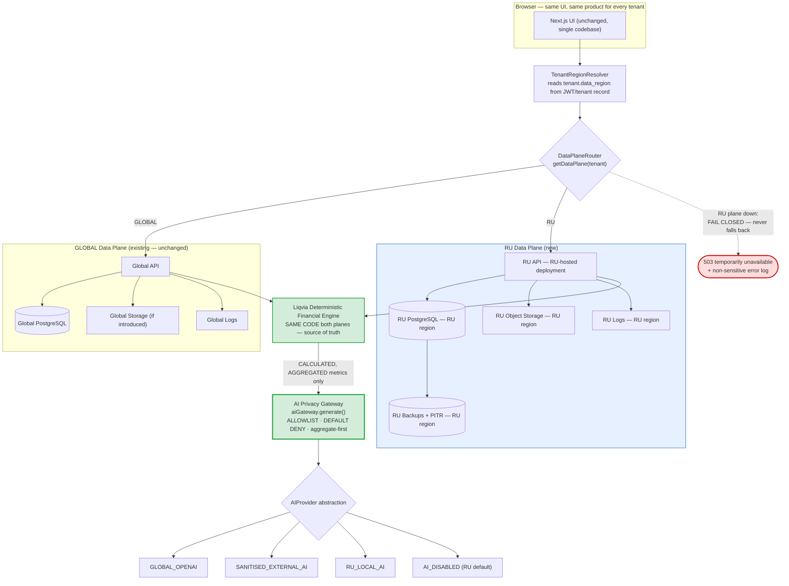
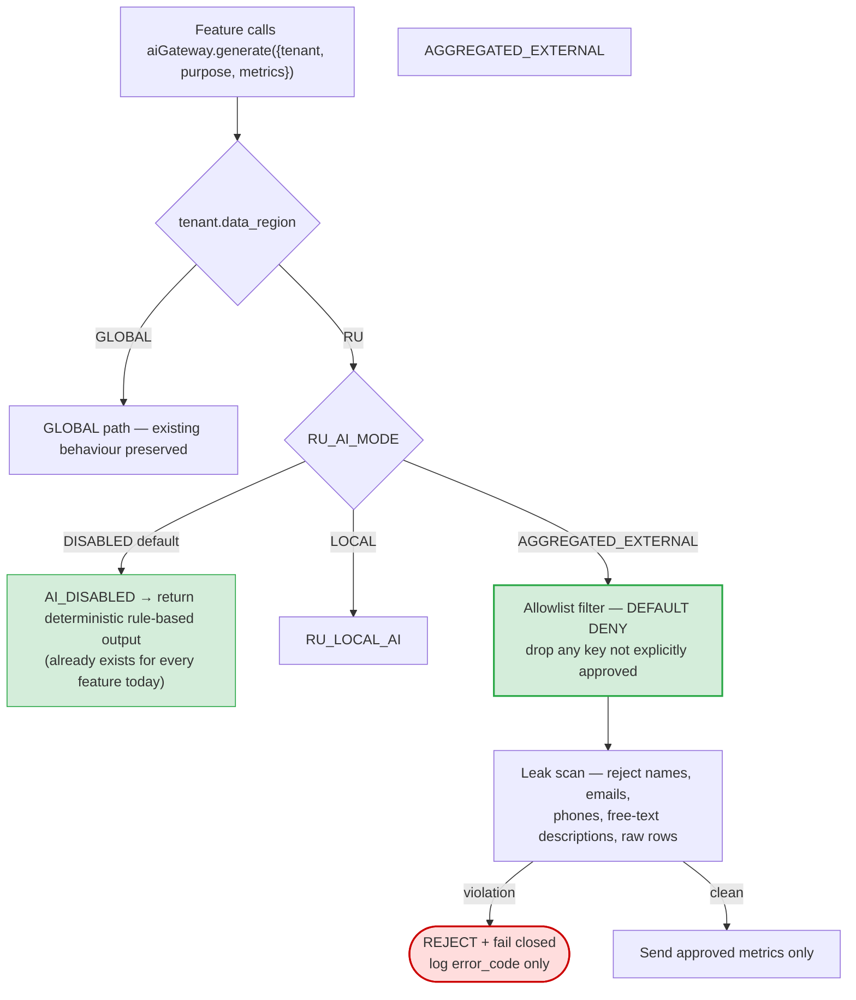

# Russia Data Residency — Data Flows: Current and Target

**Companion to** `docs/RUSSIA_DATA_ARCHITECTURE_AUDIT.md`.
**Status:** Current flows are verified against source. Target flows are a **proposal** — nothing here is implemented.

---

## Part 1 — Current state

### 1.1 Current end-to-end architecture (as deployed today)



**Read this diagram as:** there is no branch point anywhere. Every tenant, RU or not, follows one path into one database, and AI features add a second, unfiltered path to the United States.

### 1.2 Personal-data entry points (brief §4)

Every endpoint and form in the repository that accepts data in the brief's categories, and where each value goes.

| #   | Entry point                                            | Fields accepted                                                                             | Where it lands                                                                       | Reaches AI?                                 |
| --- | ------------------------------------------------------ | ------------------------------------------------------------------------------------------- | ------------------------------------------------------------------------------------ | ------------------------------------------- |
| E1  | `POST /api/auth/register` (`/register` page)           | `name`, `email`, `password`                                                                 | `UserProfile.name`, `.email`, `.passwordHash` (bcrypt, 10 rounds)                    | No                                          |
| E2  | `POST /api/auth/login`                                 | `email`, `password`                                                                         | Compared against `UserProfile`; email propagated to `UserCompanyLink.email`          | No                                          |
| E3  | `POST /api/auth/forgot-password`                       | `email`                                                                                     | Reset token hash on `UserProfile`; **email address written to logs** on SMTP failure | No                                          |
| E4  | `POST /api/cash-os-leads` (RU landing form)            | `name`, `companyName`, `phone`, `email`, `employeeCount`, `industry`, `comment` (free text) | `CashOsLead` table in the **global** DB                                              | No                                          |
| E5  | `POST /api/onboarding/*`                               | company `name`, bank account `name` + `accountNumberMasked`, invited user `name` + `email`  | `Company`, `BankAccount`, `UserCompanyLink`                                          | Indirectly — account names enter AI context |
| E6  | `POST /api/settings/*`                                 | company `name`, user `name`/`email`, chart-of-account names                                 | `Company`, `UserProfile`, `ChartOfAccount`                                           | Company name enters AI context              |
| E7  | `POST /api/uploads/validate` + `/import`               | Entire uploaded file (see §1.3)                                                             | `UploadBatch.rowSnapshot` + domain tables                                            | Yes — via context                           |
| E8  | `POST /api/uploads/ai/normalize` (single + multi-file) | Entire uploaded file, incl. PDF                                                             | Response only; **8 raw rows / 12k chars of PDF text sent to OpenAI**                 | **Yes — directly**                          |
| E9  | `POST /api/ai/chat`, `/api/ai/insight`                 | User's free-text question                                                                   | `AiInsight.context.lastUserMessage`                                                  | **Yes — directly**                          |
| E10 | `POST /api/decision-centre/*`                          | User's free-text business question                                                          | `AiInsight.context.question`                                                         | **Yes — directly**                          |
| E11 | `POST /api/recurring-obligations`                      | Obligation `name` (free text, often a payee)                                                | `RecurringObligation.name`                                                           | **Yes — via context**                       |
| E12 | `POST /api/bank-accounts`, `/api/ledger`               | Account names, transaction `description`                                                    | `BankAccount`, `CashMovement.description`                                            | **Yes — via context**                       |
| E13 | `POST /api/scenarios`                                  | Scenario `name` (free text)                                                                 | `Scenario.name`                                                                      | Via scenario summary                        |

**Identity-bearing columns in the schema:** `UserProfile.name/email`, `UserCompanyLink.email`, `CashOsLead.name/email/phone/comment`, `Receivable.customerName`, `Payable.supplierName`, `CashMovement.description`, `BankAccount.name/accountNumberMasked`, `RecurringObligation.name`, `ChartOfAccount.name`, `UploadBatch.fileName/rowSnapshot`, `AiInsight.content/context`.

**Not collected anywhere:** home address, passport/ID number, TIN/INN, date of birth, full bank account number (masked only), card data, per-employee salary rows _as a schema concept_. Note the caveat below.

> **Caveat that matters for RU.** Although no schema column asks for employee identity, the **AP Ageing** and **Bank Transactions** templates accept free text (`Supplier Name`, `Description`). A Russian customer uploading a payroll register or a 1С export will in practice put **employee names and individual salary amounts** into those free-text fields. The schema does not prevent it, validation does not detect it, and the AI context then forwards it to OpenAI. This is the practical mechanism by which employee-level personal data would leak.

### 1.3 File-import pipeline (brief §5)

Supported formats: **CSV, XLS, XLSX, PDF**. Supported templates: `trial_balance`, `ar_ageing`, `ap_ageing`, `bank_balances`, `bank_transactions`, `prior_period_budget`, `rolling_budget`, `budget` (legacy), `weekly_actuals`.



#### Stage-by-stage verification

| Stage                 | Verified behaviour                                                                                                                                             | Residency verdict |
| --------------------- | -------------------------------------------------------------------------------------------------------------------------------------------------------------- | ----------------- |
| Browser → API         | Direct multipart to Liqvia's own origin. **No signed-URL upload to any third party.**                                                                          | **GREEN**         |
| Temporary storage     | Multer memory storage — buffer in process RAM, garbage-collected after the request. **No disk, no `/tmp`, no container volume, no worker storage.**            | **GREEN**         |
| Parser                | `pdf-parse` (in-process), spreadsheet parser (in-process) — both local, no network                                                                             | **GREEN**         |
| **AI mapping assist** | Fires when rule-based confidence is `low`/`rowCount 0`, **or** for any non-`bank_transactions` template or PDF that isn't `high` confidence. Sends 8 raw rows. | **RED**           |
| **AI PDF extraction** | Fires when PDF parsing confidence is `low`. Sends 12,000 raw characters.                                                                                       | **RED**           |
| Database              | `rowSnapshot` stores rows verbatim, indefinitely                                                                                                               | **RED**           |
| Forecast engine       | Fully deterministic, no network calls                                                                                                                          | **GREEN**         |
| Logs                  | Only error strings and counts today; **no redaction policy** to keep it that way                                                                               | **YELLOW**        |
| AI context            | Full identity-bearing JSON to OpenAI on every AI feature                                                                                                       | **RED**           |
| Backup                | Follows Render Postgres; location unverified                                                                                                                   | **YELLOW**        |

**Direct answer to the brief's question — "can raw data reach foreign AI services?"**
**Yes, by three independent paths**, and two of them fire automatically without any user action beyond uploading a file.

---

## Part 2 — Target state (proposal)

### 2.1 Target architecture



**Design invariants this diagram encodes:**

1. **One codebase, one product.** The UI, the engine and the business logic are shared. Only the data plane differs.
2. **Routing is centralised.** `if (country === 'RU')` appears in exactly one place — `DataPlaneRouter` — not scattered through features.
3. **The engine stays deterministic and stays upstream of AI.** AI never calculates; it receives computed outputs.
4. **The gateway is the only exit to any LLM.** No feature may call a provider directly.
5. **Fail closed.** A RU plane outage returns 503. It never resolves to the global plane.

### 2.2 AI Privacy Gateway — request lifecycle



**RU allowlist — the only fields permitted outbound** (brief §7):

`currency` · `forecast_horizon_weeks` · `opening_cash` · `weekly_opening_cash` · `weekly_closing_cash` · `aggregated_cash_inflows` · `aggregated_cash_outflows` · `total_receivables` · `total_payables` · `total_payroll` · `total_tax_obligations` · `total_rent` · `total_debt_repayment` · `cash_runway_weeks` · `liquidity_threshold` · `scenario_pct_assumption` · `forecast_confidence_score`

**Explicitly denied, and unreachable because the default is deny:** person/employee names · email · phone · address · bank account numbers · TIN/INN · passport data · individual salaries · free-text transaction descriptions · raw bank transactions · raw documents · raw spreadsheets · customer and supplier contact details · uploaded file contents · user free text.

### 2.3 Aggregation before AI (brief §8)

The transformation the gateway must enforce:

| Today (sent verbatim)                                                  | Under the gateway                         |
| ---------------------------------------------------------------------- | ----------------------------------------- |
| `payablesDetail: [{counterparty: "ООО Ромашка", amount: 480000}, …]`   | `total_payables: 1_240_000`               |
| Payroll rows: `Иван — 180000`, `Анна — 210000`, `Сергей — 175000`      | `total_payroll: 565_000`                  |
| `cashTransactions[].description: "Оплата по договору №14 Петров И.И."` | `aggregated_cash_outflows: 3_120_000`     |
| `companyName: "ООО Ромашка"`                                           | omitted — tenant referenced as `ru_23531` |

The AI's job is unchanged: **explain the numbers the deterministic engine already produced.** It never needed identities to do that.

### 2.4 Logging policy (brief §14)

```json
{
  "tenant": "ru_23531",
  "operation": "AP_IMPORT",
  "rows": 482,
  "status": "FAILED",
  "error_code": "INVALID_DATE_FORMAT",
  "request_id": "req_01J8X…"
}
```

Permitted keys only: `tenant_internal_id` · `operation_type` · `row_count` · `request_id` · `error_code` · `duration_ms` · `status`.
Never logged: request bodies · uploaded rows · document contents · transaction descriptions · names · emails · phones · account numbers · AI prompts or responses containing customer data · passwords · access and refresh tokens.

**Immediate fix required regardless of RU work:** `backend/src/auth/mail.service.ts:38` and `:63` log recipient email addresses.

---

## Part 3 — Cross-reference

| Brief requirement          | Current state                                     | Target                            |
| -------------------------- | ------------------------------------------------- | --------------------------------- |
| §6 AI Privacy Gateway      | 7 direct OpenAI call sites, no gateway            | Single `aiGateway.generate()`     |
| §7 RU allowlist            | None — everything is sent                         | Default-deny allowlist            |
| §8 Aggregate before AI     | Individual rows sent                              | Totals only                       |
| §9 `data_region` field     | Does not exist                                    | Immutable tenant column           |
| §10 DataPlane routing      | Does not exist                                    | `DataPlaneRouter`                 |
| §11 Fail closed            | No RU plane, so no fallback logic yet             | 503, never global fallback        |
| §12 RU file storage        | No object storage at all                          | RU object storage when introduced |
| §13 Temp files             | **Already clean** — memory only                   | Preserve this property            |
| §14 Log redaction          | No policy; emails logged                          | Structured allowlist logger       |
| §15 Backups                | Unverified                                        | RU-region backups + PITR          |
| §16 Dev access             | Uncontrolled                                      | Synthetic-data-only policy        |
| §17 Pilot mode             | No flag                                           | `RU_CONTROLLED_PILOT_MODE`        |
| §18 RU safe template       | Templates request `Customer Name`/`Supplier Name` | Counterparty-code template        |
| §22 Deterministic engine   | **Already correct — do not change**               | Unchanged                         |
| §23 AIProvider abstraction | None                                              | 4-mode abstraction                |
