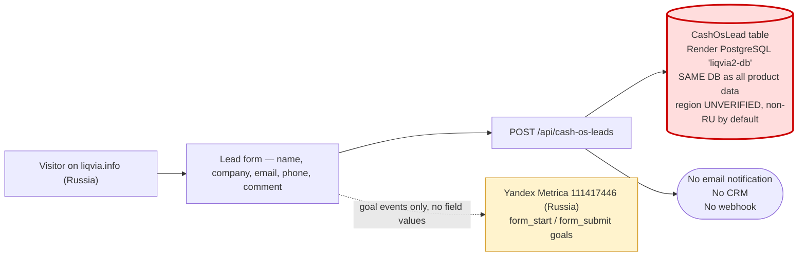

# RU Marketing — Data Flow Audit

**Status:** Current-state findings. Nothing changed.
**Scope:** The Russian landing page (`liqvia.info`) and the global marketing site's security section.
**Method:** Repository source inspection. Provider-console settings could not be read from the repo and are listed as unknowns.

---

## 1. Site topology

| Property                   | Finding                                                                                                                                                                                                       | Source                                  |
| -------------------------- | ------------------------------------------------------------------------------------------------------------------------------------------------------------------------------------------------------------- | --------------------------------------- |
| RU landing hosts           | `liqvia.info`, `www.liqvia.info`, `liqvia-landing.onrender.com`                                                                                                                                               | `frontend/src/middleware.ts:46-50`      |
| Serving mechanism          | **Same Next.js process as the product.** Middleware host-gates: `/` on a landing host rewrites internally to `/cash-operating-system` while keeping a clean root URL.                                         | `middleware.ts:80-99`                   |
| Isolation from the product | Landing hosts allow **only** `/cash-operating-system`, `/cash-os/`, `/api/cash-os-leads`, `/_next/`, `/favicon.ico`. All other paths (`/login`, `/register`, `/dashboard`, `/settings`) redirect back to `/`. | `middleware.ts:52-58,101-127`           |
| Global site                | Served from the app host (`APP_URL`, `render.yaml:34`). Not host-gated; carries the security-trust section audited in §6.                                                                                     | —                                       |
| Language                   | RU landing is Russian-only, hardcoded in components (not via the `ru.json` locale file)                                                                                                                       | `frontend/src/components/cash-os/*.tsx` |

**Assessment:** the host-gating is well built — the marketing domain genuinely cannot reach authenticated product routes. **But `liqvia.info` and the authenticated product run in the same process, against the same database, in the same region.** The isolation is at the routing layer only, not the data layer.

---

## 2. Form fields collected

Single lead form, at the `#apply` section of the RU landing (`frontend/src/components/cash-os/lead-form.tsx`).

| Field           | Label (RU)                                       | Required | Personal data?                                                        |
| --------------- | ------------------------------------------------ | -------- | --------------------------------------------------------------------- |
| `name`          | Имя                                              | **Yes**  | **Yes** — direct identifier                                           |
| `companyName`   | Компания                                         | **Yes**  | Indirect (sole traders)                                               |
| `email`         | Email                                            | **Yes**  | **Yes** — direct identifier                                           |
| `phone`         | Телефон / Telegram                               | No       | **Yes** — direct identifier                                           |
| `employeeCount` | Численность                                      | No       | No                                                                    |
| `industry`      | Отрасль                                          | No       | No                                                                    |
| `comment`       | Комментарий (free text)                          | No       | **Yes — unbounded free text**, may contain anything the visitor types |
| `source`        | Set by client to `cash-operating-system-landing` | Auto     | No                                                                    |

Validation is server-side and minimal: `name`, `companyName` and a regex-valid `email` are required; everything else is trimmed and nulled when empty (`backend/src/cash-os-leads/cash-os-leads.service.ts:12-33`). Rate limit: 5 requests/minute (`app.module.ts:39`).

---

## 3. Lead database

| Property           | Finding                                                                                                                                                       |
| ------------------ | ------------------------------------------------------------------------------------------------------------------------------------------------------------- |
| Table              | `CashOsLead` — `id`, `name`, `role`, `companyName`, `phone`, `email`, `employeeCount`, `industry`, `comment`, `source`, `createdAt` (`schema.prisma:765-779`) |
| Location           | **The single global Render PostgreSQL instance** — the same database that holds all tenant financial data                                                     |
| Region             | **Unverified; Render defaults to US-West.** No RU database exists.                                                                                            |
| Encryption at rest | Whatever Render provides at the disk level; no application-level encryption of lead fields                                                                    |
| Retention          | **None defined.** Rows persist indefinitely.                                                                                                                  |
| Deletion mechanism | **None.** No admin UI, no API endpoint, no erasure workflow.                                                                                                  |
| Access control     | No `companyId` scoping (leads are not tenant data); readable by anyone with database access                                                                   |
| Export path        | None in code                                                                                                                                                  |

**This is the primary RU marketing compliance issue:** Russian citizens' personal data collected on a Russian-targeted site is written to a database that is, by default, outside Russia.

---

## 4. Yandex Metrica

| Property            | Finding                                                                                                                                 | Source                                            |
| ------------------- | --------------------------------------------------------------------------------------------------------------------------------------- | ------------------------------------------------- |
| Counter ID          | `111417446` (hardcoded default; `NEXT_PUBLIC_YANDEX_METRICA_ID` can override)                                                           | `yandex-metrica.tsx:6`, `cash-os/analytics.ts:34` |
| Host gating         | Initialises **only** when `window.location.hostname` is `liqvia.info` or `www.liqvia.info`. The authenticated product is never tracked. | `yandex-metrica.tsx:7,14`                         |
| Script source       | `https://mc.yandex.ru/metrika/tag.js`                                                                                                   | `yandex-metrica.tsx:31`                           |
| Init options        | `ssr: true`, `clickmap: true`, `accurateTrackBounce: true`, `trackLinks: true`                                                          | `yandex-metrica.tsx:24-29`                        |
| **Webvisor**        | **NOT enabled in code** — the `webvisor` flag is absent from the init options.                                                          | `yandex-metrica.tsx:24-29`                        |
| CSP                 | 18 regional `mc.yandex.*` origins plus `yastatic.net` allowlisted for `script-src`, `img-src`, `connect-src`                            | `middleware.ts:4-35`                              |
| Data sent to Yandex | Page views, IP address, cookie/user IDs, click coordinates (clickmap), outbound link clicks, bounce timing, and the goal events below   |
| Data **not** sent   | Lead form field values. `trackCtaEvent` sends only a goal name — no payload. Verified at `cash-os/analytics.ts:32-37`.                  |

### Goal events fired

`hero_primary_cta` · `hero_secondary_cta` · `middle_primary_cta` · `pilot_apply_cta` · `form_start` · `form_submit` · `product_walkthrough_open` · `faq_click` · `deep_scroll_90` · `linkedin_click` (`cash-os/analytics.ts:12-23`)

> **Webvisor caveat — must be verified.** Webvisor is enabled **server-side in the Metrica console**, not only via the code flag. Its absence from the init options does _not_ prove it is off. If Webvisor is enabled on counter `111417446`, Yandex is recording **session replay including form input**, which would place lead-form field values into Yandex's processing — a materially different risk classification. **Verify in the Metrica console before making any statement about this.** (Unknown U8 in the main audit.)

**Positive note:** Metrica hosting is in Russia, which is the _correct_ jurisdiction for RU visitor analytics. Metrica is not the residency problem — the lead database is.

---

## 5. Cookies, consent and privacy policy

| Item                         | Finding                                                                                                                                                                                                                  |
| ---------------------------- | ------------------------------------------------------------------------------------------------------------------------------------------------------------------------------------------------------------------------ |
| Cookie banner                | **None.** No consent UI exists anywhere in the landing components.                                                                                                                                                       |
| Cookies set                  | Metrica sets `_ym_uid`, `_ym_d`, `_ym_isad`, `_ym_visorc` (if Webvisor) — first-party, set by the Yandex tag, unconditionally on page load                                                                               |
| Consent gate before tracking | **None** — Metrica initialises in a `useEffect` on mount, before any user interaction (`yandex-metrica.tsx:12-37`)                                                                                                       |
| Form consent notice          | Present as static text below the submit button: _"Отправляя форму, вы соглашаетесь с обработкой персональных данных в соответствии с Политикой конфиденциальности…"_ (`lead-form.tsx:191-195`)                           |
| Consent checkbox             | **None** — consent is implied by submission                                                                                                                                                                              |
| Consent record stored        | **None.** `CashOsLead` has no consent flag, no consent timestamp, no policy-version field. There is no evidence trail that consent was given.                                                                            |
| **Privacy policy page**      | **DOES NOT EXIST.** The notice references "Политикой конфиденциальности" but there is **no link and no privacy policy route** anywhere in the application. Verified: `frontend/src/app` contains no privacy/policy page. |
| Operator identification      | Footer names "Внедрение — Оли Брайт · Платформа — Liqvia" but no legal entity, registration details or data-controller contact (`footer.tsx:8`)                                                                          |

**This is the most immediately actionable gap in the RU marketing flow.** The site asks visitors to agree to a privacy policy that has never been published, records no evidence of that agreement, and sets analytics cookies before any consent is expressed.

---

## 6. Global site — "Data Residency Controls" claim

The global marketing site's security section renders four trust cards, the fourth being:

| Locale | Title                              | Description                                                                             |
| ------ | ---------------------------------- | --------------------------------------------------------------------------------------- |
| `en`   | Data Residency Controls            | Keep financial data aligned with regional compliance requirements.                      |
| `ru`   | Контроль резидентности данных      | Храните финансовые данные в соответствии с региональными нормативными требованиями.     |
| `es`   | Control de residencia de datos     | Mantenga los datos financieros alineados con los requisitos regionales de cumplimiento. |
| `fr`   | Contrôles de résidence des données | Alignez les données financières sur les exigences régionales de conformité.             |

Source: `frontend/src/locales/{en,ru,es,fr}.json:134-135`, rendered at `frontend/src/components/home/security-trust-section.tsx:15`.

**Verification result: the feature does not exist.** There is no tenant region field, no routing layer, no regional database and no configuration surface — verified across the full Prisma schema and full backend source. Financial data is additionally transmitted to OpenAI in the United States (see main audit §6).

**The Russian-language version of this claim is the most serious instance**, because it is presented to exactly the audience for whom data localisation is a legal requirement, and it is false.

### Recommended corrected language

Descriptive of what is true today; makes no legal, regulatory or compliance claim:

| Locale | Proposed title                       | Proposed description                                                                                                          |
| ------ | ------------------------------------ | ----------------------------------------------------------------------------------------------------------------------------- |
| `en`   | Regional Hosting Options             | Liqvia runs on managed infrastructure with hosting-region options available for enterprise arrangements.                      |
| `ru`   | Возможности регионального размещения | Liqvia работает на управляемой инфраструктуре; варианты регионального размещения обсуждаются в корпоративных договорённостях. |

**Alternative, and the safer option:** remove the fourth card entirely and keep the three remaining claims — but re-verify each of those (encryption in transit, role-based access, audit logging) before publication, since this audit did not assess them.

**Do not restore any residency claim, in any locale, until a RU data plane exists and has been independently verified.**

---

## 7. Systems explicitly NOT present

Verified absent by repository-wide search. This is a genuinely good baseline — the RU marketing flow is far cleaner than most.

| System                                                  | Present?                                           |
| ------------------------------------------------------- | -------------------------------------------------- |
| Google Analytics / GTM                                  | **No**                                             |
| Meta (Facebook) Pixel                                   | **No**                                             |
| LinkedIn Insight Tag                                    | **No** — only a `linkedin_click` Metrica goal name |
| Hotjar                                                  | **No**                                             |
| Microsoft Clarity                                       | **No**                                             |
| PostHog / Mixpanel / Plausible                          | **No**                                             |
| CRM integration (amoCRM, Bitrix24, HubSpot, Salesforce) | **No**                                             |
| Webhooks / Zapier / Make                                | **No**                                             |
| Lead notification email                                 | **No** — leads sit in the database unannounced     |
| Offline conversion upload to Yandex Direct              | **No** — not implemented                           |
| Chat widget / live chat                                 | **No**                                             |
| A/B testing tool                                        | **No**                                             |
| Third-party form provider (Typeform, Tilda)             | **No** — form is first-party                       |

**Per brief §20: do not add Google Analytics, Meta Pixel, Hotjar, LinkedIn Insight or any other tracker to the Russian marketing flow without an explicit architecture and compliance decision.** The current single-tracker state is an asset; adding US-hosted trackers to a Russian-targeted page would create new cross-border transfers.

Note also that the `marketing/ru-campaign/` strategy documents contemplate **offline conversion uploads to Yandex Direct**. That would mean sending hashed or plain lead contact data to Yandex — a new processing purpose requiring its own decision. It is not implemented today, and should not be implemented before the consent and privacy-policy gaps in §5 are closed.

---

## 8. Findings summary

| ID  | Finding                                                                                        | Severity                 |
| --- | ---------------------------------------------------------------------------------------------- | ------------------------ |
| M1  | RU leads (name, phone, email, company, free-text comment) stored in the non-RU global database | **RED**                  |
| M2  | "Data Residency Controls" advertised in RU and 3 other locales; feature does not exist         | **RED**                  |
| M3  | Consent notice references a privacy policy that **has never been published**                   | **RED**                  |
| M4  | No consent record stored — no checkbox, no timestamp, no policy version; no evidence trail     | **RED**                  |
| M5  | Metrica cookies set before any consent is expressed; no cookie banner                          | **YELLOW**               |
| M6  | Webvisor state unverified — if enabled server-side, form input is being recorded               | **YELLOW**               |
| M7  | Lead data has no retention limit and no deletion/erasure mechanism                             | **YELLOW**               |
| M8  | No data-controller/operator identification on the site                                         | **YELLOW**               |
| M9  | Metrica counter ID hardcoded as a source-code default rather than configuration                | **GREEN** (hygiene only) |
| M10 | Landing host-gating correctly blocks product routes                                            | **GREEN**                |
| M11 | No form field values sent to any analytics provider                                            | **GREEN**                |
| M12 | Single tracker, RU-hosted; no US-hosted trackers on the RU page                                | **GREEN**                |

## 9. Recommended sequence (marketing only)

These are cheap, are independent of the RU data-plane programme, and reduce exposure immediately.

1. **Correct or remove the "Data Residency Controls" claim in all four locales** — M2. Highest priority; it is a false statement currently being published.
2. **Publish a privacy policy** and link it from the form notice and footer — M3. The site already promises one.
3. **Add an explicit consent checkbox** and persist `consentGivenAt` + `consentPolicyVersion` on `CashOsLead` — M4.
4. **Verify Webvisor** in the Metrica console and record the answer — M6.
5. **Add a cookie consent gate** before Metrica initialises — M5.
6. **Define a lead retention period** and build a deletion path — M7.
7. **Add operator/controller identification** to the footer — M8.
8. **Decide, deliberately, where RU leads should live** — M1. This is the item that couples to the main RU data-plane programme; the first seven do not.

Steps 1–3 should not wait for any architectural decision.
